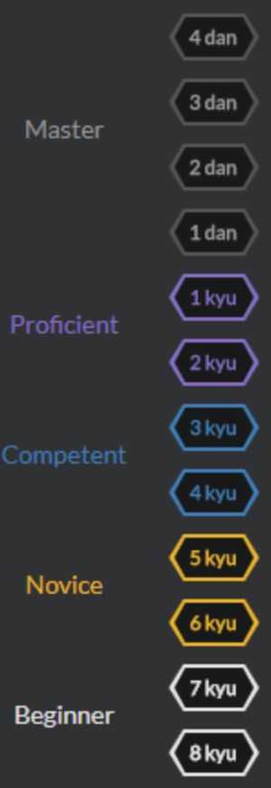

# Codewars?

Codewars é uma comunidade educacional para programação de computadores. Na plataforma, os desenvolvedores de software treinam em desafios de programação conhecidos kata e são classificados em kyus.

# Sistema de classificação

